# Cloud DNS CNAME Chasing Automation

## Purpose

This project provides an automated solution to overcome the limitations of Google Cloud DNS when it comes to CNAME chasing within private zones with local records (not forwarding zones).

**The Problem:**

[Google Cloud DNS, by default, does *not* perform CNAME chasing](https://cloud.google.com/dns/docs/cnamechasing) (following the CNAME chain to the ultimate A or AAAA record) when dealing with CNAME records inside private zones with local records. Specifically:

*   Cloud DNS systems *do* perform queries for the CNAME answer in Cloud DNS private zones that are authorized for the VPC network.
*   Cloud DNS systems *don't* perform queries for the CNAME answer in any public DNS zones, including Cloud DNS public zones.

This can be problematic when you want to point a record in your private zone to a CNAME that resolves to an IP address, especially when the CNAME might point to a resource whose IP might change, as in some multicloud architectures.

**The Solution:**

This automation addresses this limitation by periodically resolving the target of the CNAME record and updating the corresponding A record in the Cloud DNS private zone. It essentially simulates CNAME chasing by:

1.  **Resolving the CNAME Target:** It uses the `dns.resolver` library from `dnspython` to resolve the CNAME record target.
2.  **Updating A Records:** It uses the Google Cloud DNS API to delete the existing record, and create a new A record with the IP address obtained from the CNAME resolution.
3. **Periodically Running:** A Cloud Scheduler job triggers the automation at regular intervals.

## Architecture

The solution consists of the following Google Cloud components:

```mermaid
graph LR
    subgraph "Google Cloud Project"
        A[Cloud Scheduler] -->|"HTTP POST (OIDC)"| B(Cloud Function);
        B -->|"Cloud DNS API (dns-updater-sa)"| C[Cloud DNS Private Zone];
        B -->|"DNS Query (dnspython)"| D((CNAME Target));
    end

    subgraph "Service Accounts"
        style B fill:#1B2F69,stroke:#333,stroke-width:2px
        E[dns-updater-sa]
        F[scheduler-invoker-sa]
        G[cloud-build-sa]
        B -- Uses --> E
        A -- Uses --> F
    end

    style A fill:#1B2F69,stroke:#333,stroke-width:2px
    style C fill:#1B2F69,stroke:#333,stroke-width:2px
    style D fill:#1B2F69,stroke:#333,stroke-width:2px
    style G fill:#1B2F69,stroke:#333,stroke-width:2px

    classDef sa fill:#1B2F69,stroke:#333,stroke-width:2px;
    class E,F,G sa;

    subgraph "Permissions"
 
        J[cloud-build-sa] -->|cloudbuild.builds.builder <br> run.builder| B
        J -->|cloudbuild.builds.builder <br> run.builder| G
    end

```

1.  **Cloud DNS Private Zone:** This is the target private zone where the A record will be updated. This zone is configured to be used by your VPC network.

2.  **Cloud Function:**
    *   **Trigger:** HTTP trigger. It's invoked by the Cloud Scheduler job.
    *   **Purpose:**
        *   Receives the `DNS_NAME` and `CNAME_TARGET`  as environment variables.
        *   Uses `dnspython` to resolve the `CNAME_TARGET` and get a list of corresponding IP addresses.
        *   Uses the Cloud DNS API to delete existing resource record sets for the `DNS_NAME` in the private zone.
        *   Creates a new A record set for the `DNS_NAME`, using the list of IP addresses obtained from the CNAME resolution.
        * Handles the case where there is no resolution for the CNAME.
        * Returns a valid HTTP response.
    * **Dependencies:**
        * `google-cloud-dns==0.35.0`
        * `dnspython`

3.  **Cloud Scheduler:**
    *   **Purpose:** Triggers the Cloud Function at a defined interval (e.g., every hour).
    *   **Configuration:**
        *   HTTP target (pointing to the Cloud Function's URL).
        *   POST method.
        *   OIDC authentication (using the `scheduler-invoker-sa` service account).
    * **Schedule:**
        *   Configurable via the `JOB_INTERVAL_MINUTES` environment variable in `scheduler.sh`.
        *   Defaults to every 60 minutes if not set.

4.  **Service Accounts:**

    *   **`dns-updater-sa` (DNS Editor Service Account):**
        *   **Purpose:** This service account is used by the Cloud Function to interact with the Cloud DNS API.
        *   **Permissions:** `roles/dns.admin` (DNS Administrator) - This role allows the service account to create, delete, and modify records in Cloud DNS.
        *   **Used by:** Cloud Function.

    *   **`scheduler-invoker-sa` (Scheduler Invoker Service Account):**
        *   **Purpose:** This service account is used by Cloud Scheduler to invoke the Cloud Function.
        *   **Permissions:** `roles/run.invoker` (Cloud Run Invoker) - This role allows the service account to trigger Cloud Functions.
        *   **Used by:** Cloud Scheduler.

    *   **`cloud-build-sa` (Cloud Build Service Account):**
        *   **Purpose:** This service account is used by Cloud Build to build and deploy the Cloud Function.
        * **Permissions:**
             * `roles/cloudbuild.builds.builder` (Cloud Build Builder) - Allows the Cloud Build to manage builds.
             * `roles/run.builder` (Cloud Run Builder) - Allows the Cloud Build to deploy to Cloud Run.
        * **Used by:** Cloud Build

## Workflow

1.  **Cloud Scheduler Triggers:** At the configured interval, Cloud Scheduler invokes the Cloud Function using the `scheduler-invoker-sa` service account.
2.  **Cloud Function Executes:**
    *   The Cloud Function runs with the permissions of the `dns-updater-sa` service account.
    *   It gets the required `DNS_NAME` and `CNAME_TARGET` variables from the environment variables.
    *   It resolves the CNAME using `dnspython`.
    *   It deletes all existing records for `DNS_NAME` in the specified Cloud DNS zone.
    *   It adds a new A record with the resolved IP addresses.
    *   Returns a message depending on if the record was updated or not.
3.  **DNS Updated:** The Cloud DNS zone is updated, effectively achieving CNAME chasing.

## Benefits

*   **Automated CNAME Chasing:** Automatically keeps the A record updated with the latest IP address of the CNAME target.
*   **Works with Private Zones:** Extends CNAME chasing to Cloud DNS private zones with local records.
*   **No manual updates:** No need to manually change the A records when the target CNAME IP changes.
* **Idempotent** the scripts can run multiple times without causing errors.

## Prerequisites

*   Google Cloud project
*   Cloud DNS private zone
*   VPC Network
*   Enabled API:
    * Cloud Functions
    * Cloud Scheduler
    * Cloud DNS
    * Cloud Build
    * IAM

## Deployment

1. Set up the prerequisites.
2. Run `sa.sh` to create the service accounts.
3. Run `deploy-function.sh` to deploy the function.
4. Run `scheduler.sh` to create/update the scheduler.

This project solves a specific issue in the Google Cloud ecosystem and offers a robust solution for achieving CNAME chasing within Cloud DNS private zones.
